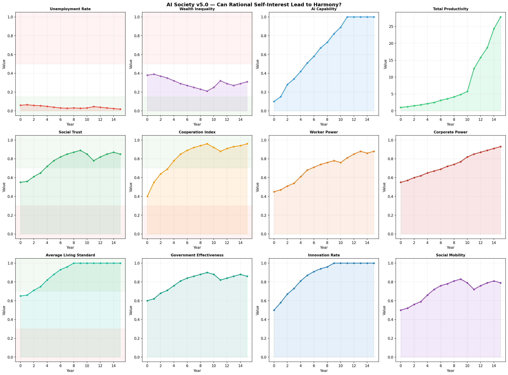

# AI Society Simulator（中文说明）

[English README](README.md)

这是一个自由形式（free-form）的多智能体社会模拟沙盒，用来探索在 AI / AGI 快速扩散的背景下，不同社会角色如何互动、博弈与适应。

项目结合了：
- 基于大语言模型（LLM）的智能体讨论与决策
- 规则约束下的世界状态演化
- 内生技术增长机制
- 社会经济指标自动可视化

它试图探索这样的问题：

- AI 会如何影响失业、贫富差距和社会信任？
- 在什么条件下，理性自利可能收敛为合作？
- AGI 带来的生产力增长，是否可能被分配为一种稳定的社会秩序？
- 在大规模自动化背景下，会出现什么样的新制度安排？

---

## 示例输出

### 这张图说明了什么
这次示例运行呈现出一个相对乐观的适应路径：

- AI 能力和总生产力快速上升
- 失业率保持在较低水平
- 平均生活水平持续提高
- 社会信任和合作程度增强
- 贫富差距依然存在，但没有失控

### 这张图不说明什么
- 它**不能预测真实未来**
- 它**不能证明 AGI 一定会导向大同社会**
- 这只是**某一组 prompt / 参数 / 初始条件下的一次单次运行**
- 结果对 prompt、模型行为和设定都高度敏感

所以，这张图更适合被理解为一种**情景探索（scenario exploration）**，而不是预测结论。

---

## 主要特性

- 多智能体社会模拟
- 异质角色之间的自由讨论
- 内生技术增长动态
- 可选的 AGI 关键年份锚点
- 可配置的初始世界状态
- 支持云端 API 与本地 OpenAI-compatible 模型后端
- 自动生成仪表盘图表
- 支持 dry-run 低成本调试

---

## 默认角色类型

当前默认角色包括：

- 工人
- 雇主 / 企业家
- 立法者
- 工会组织者
- 经济学者
- 投资人
- 记者

每个智能体都有：
- 角色身份
- 性格设定
- 核心目标
- 短期记忆

---

## 项目结构

    ai-society-sim/
    ├── .env.example
    ├── .gitignore
    ├── README.md
    ├── README_zh.md
    ├── pyproject.toml
    ├── configs/
    │   └── default.yaml
    ├── assets/
    │   └── dashboard.png
    └── src/
        └── ai_society_sim/
            ├── agents.py
            ├── cli.py
            ├── config.py
            ├── forum.py
            ├── llm.py
            ├── simulation.py
            ├── viz.py
            └── world.py

---

## 安装方法

克隆仓库：

    git clone https://github.com/yang-source-ai/ai-society-sim.git
    cd ai-society-sim

可编辑安装：

    python -m pip install -e .

---

## 配置方法

在项目根目录创建 `.env` 文件。

云端 API 示例：

    LLM_BASE_URL=https://api.deepseek.com
    LLM_API_KEY=your_api_key_here
    LLM_MODEL=deepseek-chat
    DRY_RUN=false

本地 Ollama 示例：

    LLM_BASE_URL=http://localhost:11434/v1
    LLM_API_KEY=ollama
    LLM_MODEL=qwen2.5:7b
    DRY_RUN=false

---

## 运行方式

Dry-run 模式（不调用 API）：

    python -m ai_society_sim.cli --config configs/default.yaml --dry-run

正常运行：

    python -m ai_society_sim.cli --config configs/default.yaml

---

## 输出结果

程序会自动保存：
- 世界状态历史（JSON）
- 论坛 / 讨论日志（JSON）
- 每年总结（JSON）
- 仪表盘图像（PNG）

默认输出目录为：

    outputs/

---

## 配置文件说明

主要实验设定位于：

    configs/default.yaml

这个文件控制：
- 模拟时长
- 每年讨论轮数
- 每轮发言人数
- 初始世界状态
- 内生技术增长参数
- 可选的 AGI 关键锚点

---

## 方法说明

本项目采用混合式设计：

### 1. 智能体层
智能体通过 LLM 进行讨论、谈判和行动决策。

### 2. 世界状态层
系统追踪以下宏观变量：
- 失业率
- 贫富差距
- 社会信任
- 工人力量
- 企业力量
- 政府有效性
- 创新率
- 社会流动性
- 合作指数
- 总生产力
- AI 能力水平

### 3. 技术演化层
技术增长并不完全依赖手写的逐年剧情，而主要由以下因素内生推动：
- 创新能力
- 企业投资
- 合作水平
- 制度支持
- 公众接受度

### 4. 叙事总结层
系统会为每一年生成自然语言摘要，帮助解释数值变化背后的社会含义。

---

## 局限性

这个项目**不是现实预测模型**。

它更像一个实验性的社会模拟框架，用来探索不同假设条件下的可能轨迹。

结果高度依赖于：
- 模型对齐方式
- prompt 设计
- 初始状态
- 后端模型行为
- 场景 framing

单次运行应被视为一种**可能轨迹**，而不是定论。

---

## Roadmap

- [x] 模块化项目结构
- [x] CLI 运行入口
- [x] YAML 配置
- [x] 内生技术增长
- [x] 仪表盘可视化
- [ ] 多次运行统计（Monte Carlo）
- [ ] 社交网络结构
- [ ] 长期记忆 / 向量记忆
- [ ] 场景对比报告
- [ ] 交互式 Web UI

---

## License

MIT

---

## 为什么做这个项目

**我想知道，如果 AI 极大扩展了生产力，那么决定社会走向崩溃、适应还是“大同”的关键变量到底是什么？**

如果你也对这个问题感兴趣，欢迎提 issue、给建议，或者直接 fork。
